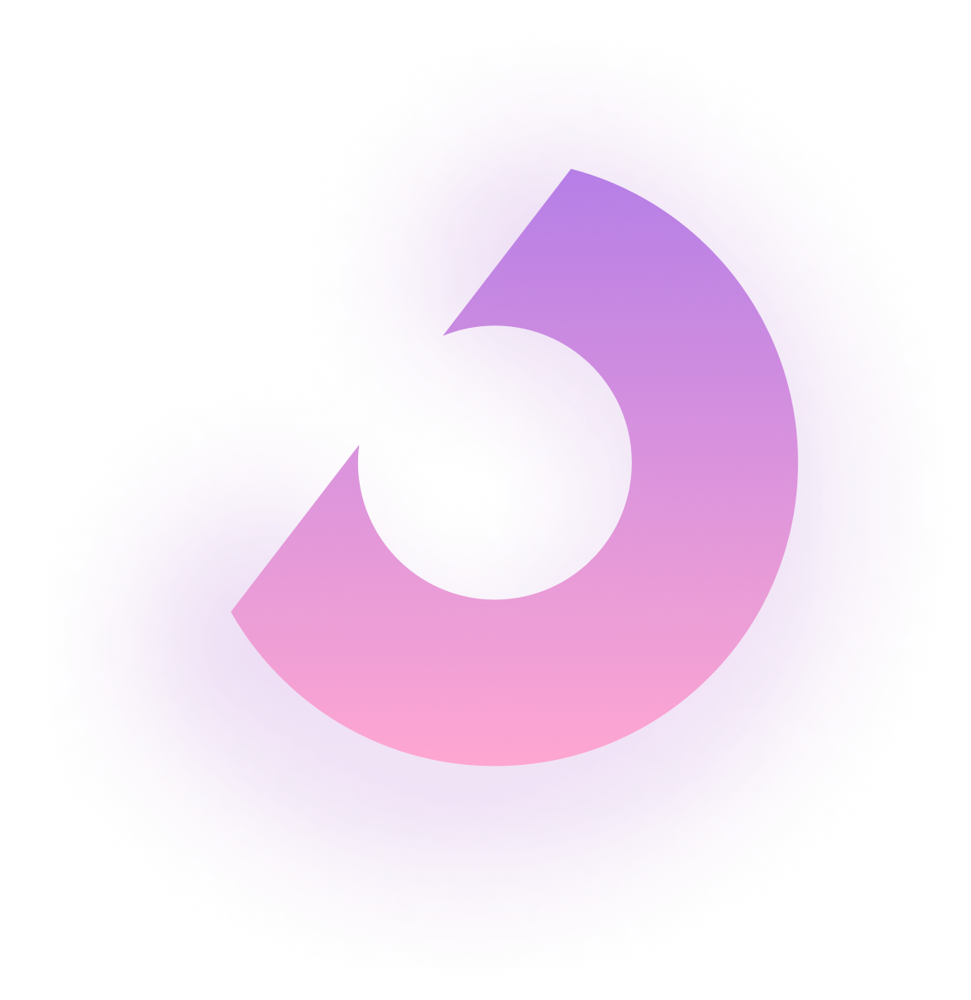

<h1 align="center">
  <br>
  <a href=""></a>
  <br>
  Lone Number
  <br>
</h1>

<h4 align="center">Mobile app for Android and iOS to help calculates the outlier
<!-- <a href="http://electron.atom.io" target="_blank">Electron</a> -->
.</h4>

<!-- <p align="center">
  <a href="https://badge.fury.io/js/electron-markdownify">
    
  </a>
  <a href="https://gitter.im/amitmerchant1990/electron-markdownify"></a>
  <a href="https://saythanks.io/to/bullredeyes@gmail.com">
      
  </a>
  <a href="https://www.paypal.me/AmitMerchant">
    
  </a>
</p> -->

<p align="center">
  <a href="#key-features">Key Features</a> •
  <a href="#how-to-use">How To Use</a> •
  <a href="#download">Download</a> •
  <a href="#credits">Credits</a> •
  <a href="#related">Related</a> •
</p>

<!--  -->

## Key Features

* Calculating the outlier of an array of integers
* Visual demonstration of outliers
* Dark/Light mode
* Cross platform
  - iOS, Android.

## How To Use
* For Develop

To clone and run this application, you'll need [Git](https://git-scm.com) and [Flutter](https://docs.flutter.dev/get-started/install) installed on your computer. From your command line:

```bash
# Clone this repository
$ git clone https://github.com/Maciejj1/Lone_Number.git

# Enter the folder
$ cd lone_number

# Install dependencies
$ flutter pub get

# Run the app
$ flutter run
```

## Download

- For iOS [click to download](https://www.mediafire.com/file/fuo2cl5w51vn9np/LoneNumber.app.zip/file) the latest version of Lone Number - v1.0.0.
- For Android [click do download](https://drive.google.com/file/d/1-QDXwpiX8wJSXQK1n8hcL9o8TGqDNvL0/view?usp=share_link) the latest version of Lone Number - v1.0.0.

## Created using

This application was created using:

<p align="left"> <a href="https://dart.dev" target="_blank" rel="noreferrer">  </a> <a href="https://www.figma.com/" target="_blank" rel="noreferrer">  </a>  </a> <a href="https://flutter.dev" target="_blank" rel="noreferrer">  </a> <a href="https://git-scm.com/" target="_blank" rel="noreferrer">  </a><a href="https://bloclibrary.dev" target="_blank" rel="noreferrer"></a><a href="https://en.wikipedia.org/wiki/SOLID" target="_blank" rel="noreferrer"></a></a></p>


---

> [maciejwawryszuk.pl](https://maciejwawryszuk.pl) &nbsp;&middot;&nbsp;
> GitHub [@maciejj1](https://github.com/Maciejj1) &nbsp;&middot;&nbsp;
> Linkedin [@Maciek Wawryszuk](https://www.linkedin.com/in/maciek-wawryszuk-484737225/)
